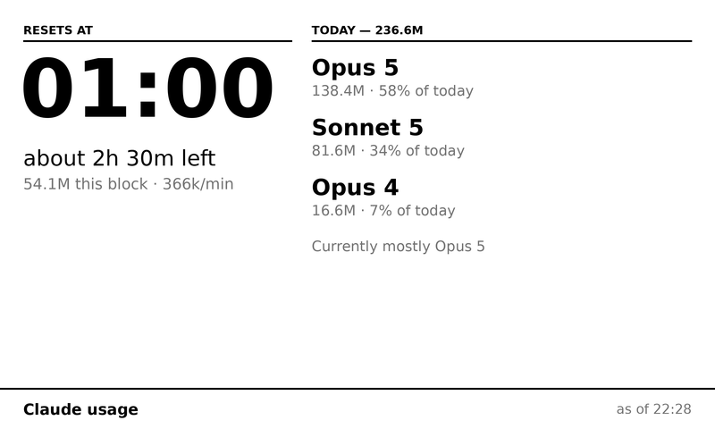

# Claude Usage for TRMNL

A small framework for pushing anything you can compute in Obsidian to a
[TRMNL](https://trmnl.com) e-ink display — shipping with one screen built in:
your Claude Code token usage.

The screen is the demo. The point is the machinery around it.

```ts
export const myScreen: Screen = {
  id: "my-screen",
  label: "My screen",
  blurb: "One line describing what lands on the display.",
  defaultEvery: 360,
  async collect(app) {
    return { headline: "42", as_of: "14:05" };
  },
};
```

Add that to an array, write four Liquid templates, done. You get the scheduler,
the push budget, a settings UI and the error handling for free.



<sub>The `full` layout, drawn at the panel's native 800×480 from the values the template actually renders. A render, not a photo of hardware — regenerate with `python3 docs/panel.py`.</sub>

## What the framework gives you

| | |
|---|---|
| **Per-screen scheduling** | One ticker; each screen declares how often its data actually changes. A screen that isn't due costs nothing. |
| **Shared push budget** | TRMNL allows 12 pushes/hour per *account* (30 on TRMNL+). A sliding window tracks it across every screen, with what's left shown in the status bar. |
| **Unchanged-payload skip** | A content hash means re-sending identical data costs no budget — most ticks land here. |
| **Real Obsidian settings UI** | Per-screen enable, webhook UUID, refresh override, a Push button, and a live payload byte counter against your tier's limit. |
| **Credential masking** | Every field holding a UUID or token is a masked input. |
| **Guards for the mistakes that don't look like mistakes** | Duplicate-UUID detection, over-budget schedule warning, mobile skip for desktop-only screens. |
| **Loud failures** | A collector that can't read its source throws. It never quietly reports zero. |

Adding a screen means writing a `collect()` and four templates. Nothing else —
no settings field, no timer, no push call.

[**AGENTS.md**](AGENTS.md) is the full guide to writing one. It's aimed at
coding agents, but it's the honest documentation either way: the screen
contract, the budget model, and the TRMNL layout traps that cost real time to
find — including three places where `docs.trmnl.com` disagrees with the
platform.

## The built-in screen: Claude Code usage

Reads your local Claude Code transcripts, works out where you are in the current
five-hour usage block, and pushes a summary. No API key, no third-party service,
no `npx` — the numbers come from files already on your disk.

- When the current usage block resets, and roughly how long is left
- Tokens used this block, and the current burn rate per minute
- Today's total, split by model
- The time it was collected, on every layout

All four TRMNL sizes are included (`full`, `half_horizontal`, `half_vertical`,
`quadrant`), so the screen works inside a mashup as well as on its own.

**This screen is desktop-only** — it reads `~/.claude/projects`, which mobile
Obsidian can't. It's skipped on mobile rather than failing there. A screen you
write that only reads the vault will run everywhere; see AGENTS.md for how to
flip the manifest if you drop this one.

## Why an Obsidian plugin

Mostly because Obsidian is already running. It gives you a cross-platform host
process with a settings UI, a scheduler, and a place to keep configuration —
none of which you want to hand-roll as a daemon for one small screen. Your vault
is also, conveniently, full of things worth putting on a wall.

## Setup

1. Install the plugin and enable it.
2. On trmnl.com, create a **private plugin** with strategy **Webhook**. Copy its
   UUID.
3. Paste the four files from `templates/claude-usage/` into that plugin's markup
   editor — one per size.
4. In the plugin's settings tab, enable the screen and paste the UUID.
5. Run **Push all enabled screens now** from the command palette.

Each screen is its own private plugin with its own UUID — TRMNL's playlist
rotates plugin *instances*, so two screens can't share one.

## A note on freshness

Pushes stop while the machine is asleep. A closed laptop means the panel keeps
showing whatever it last received, which is why the collection time appears on
every layout: an hours-old block total that looks live is worse than no screen
at all.

## Building

```bash
npm install
npm run build
```

Copy `main.js`, `manifest.json` and `styles.css` into
`<vault>/.obsidian/plugins/trmnl-claude-usage/`.

---

## Security

**Read this before you put a credential in the settings tab.** How exposed it is
depends entirely on how *your* vault is set up, and this plugin cannot control
that.

### Where credentials can live

Three places, and the plugin uses the first one that has a value. The settings
tab always tells you which is in force.

| Source | Where it lives | Exposure |
|---|---|---|
| **Environment variable** | `TRMNL_UUID_CLAUDE_USAGE` (`TRMNL_UUID_<SCREEN_ID>`) | Never written to disk. Best option if you already manage secrets this way. |
| **External file** | `$XDG_CONFIG_HOME/obsidian-trmnl/credentials.json`, or `%APPDATA%` on Windows — created `0600`, directory `0700` | Outside the vault, so it is not synced, committed or backed up with your notes. |
| **Vault** *(default)* | `<vault>/.obsidian/plugins/trmnl-claude-usage/data.json`, plaintext | Travels with your vault everywhere it goes. |

If your credential is still in the vault, the settings tab says so in amber and
offers a **Move out of the vault** button: it writes the external file, sets the
permissions, and clears the value from `data.json`. It only clears the vault
copy after the write succeeds.

### Why not just encrypt data.json?

Because it would not help, and it would look like it did.

Obsidian does not sandbox plugins from one another. Every community plugin you
install runs in the same process with the same filesystem access, so anything
this plugin can decrypt — via the OS keychain, Electron `safeStorage`, or a
local key file — any other plugin can decrypt too, by calling the same API. The
ciphertext and the means to read it would sit on the same machine.

The credential is exposed by being inside an artifact that gets **synced,
committed and backed up**, not by being unencrypted in it. So the fix is to move
it out of that artifact, which needs no cryptography at all.

Concretely — what moving it out of the vault does and does not prevent:

| | |
|---|---|
| ✅ Prevents | Sync carrying it to a third party; `git add -A` publishing it; backup snapshots keeping it forever; another user reading your vault folder; a screenshot of a file listing |
| ❌ Does not prevent | A malicious Obsidian plugin; malware running as your user; anyone with your unlocked machine |

Nothing a plugin can do prevents the second column. Anyone claiming otherwise is
selling you comfort.

### A webhook UUID is a bearer credential

Anyone holding it can POST to your display. There is no second factor, no
signature, no origin check — the URL *is* the authentication. The blast radius
is real but bounded: someone can write nonsense to your screen. They cannot read
your vault or your TRMNL account through it. Rotate one by deleting and
recreating the private plugin on trmnl.com.

The realistic leak is a screenshot. You hit a problem, you capture the settings
tab to ask for help. Every credential field here is a masked input to make that
survivable — but reveal one and forget, and it is in the image.

### Where your setup changes the risk

This table is about the **vault** option only. Move the credential out and every
row below stops applying — which is the entire reason the other two options
exist.

| Your setup | What it means for a credential left in `data.json` |
|---|---|
| **Obsidian Sync** | Config sync is opt-in per category. If plugin settings are included, your credentials travel to every synced device and through Obsidian's servers. |
| **iCloud / Dropbox / Google Drive** | Credentials sit in a third party's storage, in plaintext, under whatever retention and sharing that provider applies. Check the folder isn't in a shared drive. |
| **Git-backed vault** | One `git add -A` with a missing `.gitignore` publishes the file. If your vault repo is public, assume compromise and rotate immediately — and remember history keeps it after deletion. |
| **Shared or work machine** | Any user who can read your vault directory can read the file. There are no filesystem permissions beyond whatever your vault folder already has. |
| **Backups** | Plaintext credentials are in every snapshot, including ones you can't easily purge. |

### If you add screens that need real credentials

The built-in Claude usage screen needs nothing but a webhook UUID. If you write
a screen that talks to an API:

- Resolve it through `src/secrets.ts` rather than reading settings directly, so
  it inherits the env / external-file / vault precedence and the migration
  button for free.
- Prefer **read-only, narrowly-scoped** tokens. A stats-read key is a much
  smaller problem than an account-wide one, wherever it is stored.
- Prefer a token you can **rotate cheaply** and that has an expiry.
- Mask the field with the existing `secret()` helper.
- Remember that no storage location here defends against another installed
  plugin. For a genuinely high-value credential, consider fetching the data in
  something outside Obsidian and writing the result into a note, so the token
  never reaches your vault or this process at all.

### What this plugin sends, and where

Outbound requests go to exactly one place: `https://trmnl.com/api/custom_plugins/<your-uuid>`,
carrying only the merge variables your screen's `collect()` returned. No
telemetry, no analytics, no other endpoints. The Claude usage collector reads
`~/.claude/projects` locally and sends only aggregate token counts — never
prompts, responses, or file contents.

## License

MIT
